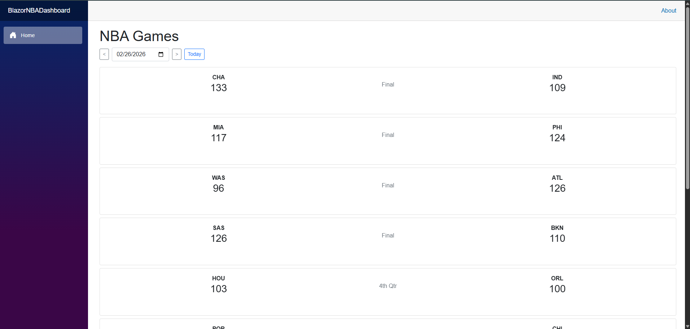
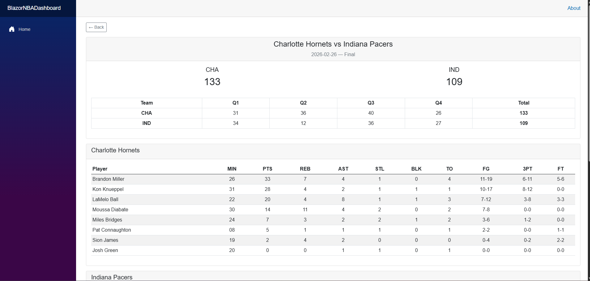

# NBA Dashboard — Blazor Web App

A Blazor Server application that displays NBA game scores, schedules, and player box scores using the [BallDontLie API](https://www.balldontlie.io/).

## Features

- Browse NBA games by date with a date picker
- View game scores with quarter-by-quarter breakdown
- View detailed player box scores for completed games
- Client-side caching to minimize API calls

## Tech Stack

- .NET 8 / Blazor Server
- C#
- Bootstrap 5
- BallDontLie API

## Getting Started

1. Clone the repository
2. Create a free API key at [app.balldontlie.io](https://app.balldontlie.io)
3. Create an `appsettings.Development.json` file in the project root:
```json
{
  "BallDontLieApi": {
    "ApiKey": "your-api-key-here",
    "BaseUrl": "https://api.balldontlie.io/nba/v1"
  }
}
```

4. Run the project in Visual Studio or with `dotnet run`

## Notes

- The free API tier allows 5 requests per minute. Caching is implemented to reduce redundant calls.
- Player box scores require the ALL-STAR tier ($9.99/mo).

## Demo

### Games Page


### Game Detail with Box Score


### Video Walkthrough
A full demo recording is available in the [screenshots folder](Screenshots/NbaDashboardDemo.mp4).
